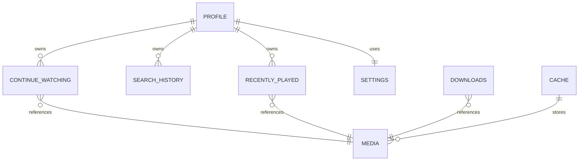

# OneForAll

Database Design

Version: 0.1 (Draft)

---

# Purpose

The database provides reliable local persistence for OneForAll.

Its purpose is to improve responsiveness, preserve user preferences, support offline functionality where practical, and reduce unnecessary network requests.

The database is considered an implementation detail of the application and should never dictate business logic.

---

# Storage Philosophy

OneForAll follows a **Smart Memory** philosophy.

Information that meaningfully improves the user experience should be remembered automatically whenever practical.

Examples include:

- Continue Watching
- Playback progress
- Subtitle preferences
- Audio preferences
- Search history
- Recently played media
- Active profile
- User settings

Users should always retain the ability to clear remembered information or disable optional history features.

The application remembers useful information by default while avoiding unnecessary or permanent storage.

---

# Design Principles

The database should be:

- Reliable
- Predictable
- Fast
- Offline-friendly
- Easy to migrate
- Independent of external APIs

Business logic belongs in the Application Logic layer rather than the database.

---

# Data Categories

Application data is divided into three categories.

## Persistent Data

Information intentionally retained between application launches.

Examples:

- Profiles
- Settings
- Playback history
- Continue Watching
- Downloads
- Search history
- Favorite items

---

## Cached Data

Temporary information retained to improve performance.

Examples:

- Search results
- Metadata
- Artwork
- Subtitle search results
- Provider responses

Cached data may be deleted at any time without affecting user data.

---

## Session Data

Temporary information associated with the current application session.

Examples:

- Active search
- Current playback state
- Navigation state
- Temporary selections

Session data should not be stored in the database unless persistence provides a clear user benefit.

---

# Primary Entities

The initial database consists of the following logical entities.

## Profile

Stores persistent user preferences.

Examples:

- Playback preferences
- Subtitle preferences
- Provider priorities
- Theme preferences

---

## Settings

Stores global application configuration.

Examples:

- Network behavior
- Cache limits
- Experimental features

---

## Continue Watching

Stores playback progress.

Examples:

- Current position
- Last watched timestamp
- Episode information
- Resume status

---

## Search History

Stores previous searches to improve usability.

Search history should be user-configurable and may be cleared at any time.

---

## Recently Played

Stores recently viewed media.

Used for quick access and recommendations.

---

## Downloads

Tracks offline media managed by the application.

---

## Cache Records

Tracks cached application data.

Each cache type should define its own expiration policy.

---

# Data Ownership

Each entity has a single owning subsystem.

| Entity | Owner |
|---------|-------|
| Profiles | Profile System |
| Settings | Settings System |
| Continue Watching | Playback System |
| Search History | Search System |
| Recently Played | Playback System |
| Downloads | Download System |
| Cache | Cache System |

Ownership determines which subsystem is responsible for creating, updating, and deleting data.

Other systems access data through repositories rather than directly.

---

# Relationships

---

# Cache Strategy

Caching exists solely to improve responsiveness.

Cached information:

- May expire automatically.
- May be regenerated.
- Should never replace authoritative user data.

Loss of cache must never result in permanent information loss.

---

# Backup & Restore

The application should support backup and restore of persistent user data.

Backups should include:

- Profiles
- Settings
- Playback history
- Continue Watching

Caches should not be included in backups.

---

# Migrations

Database schema changes should preserve user data whenever practical.

Breaking schema changes require:

- Migration planning
- Documentation updates
- Version increment

Destructive migrations should only occur when no reasonable migration path exists.

---

# Future Expansion

Future entities may include:

- Trakt synchronization
- Jellyfin synchronization
- Additional debrid providers
- User collections
- Watchlists

Future additions should extend the existing architecture without requiring structural redesign.